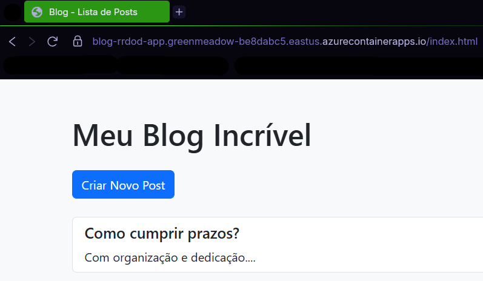
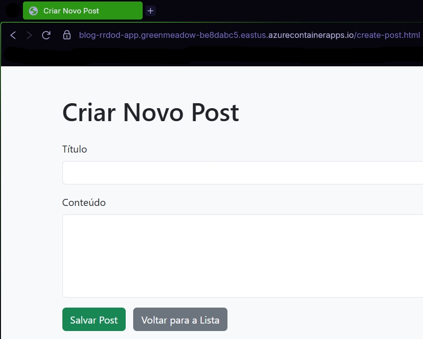
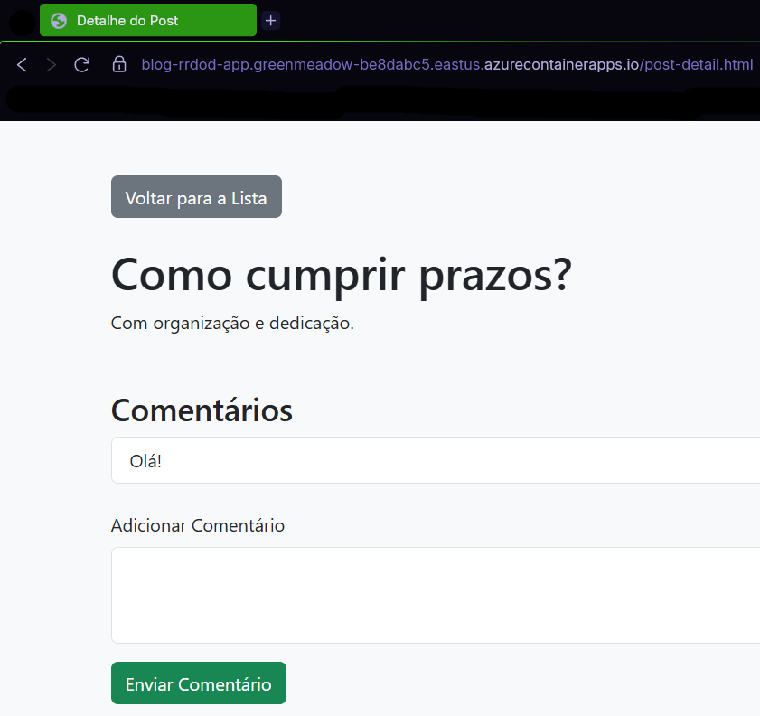

#  Meu Blog Incrível - Implantado no Azure Container Apps

Este é um projeto de blog simples, desenvolvido com tecnologias web básicas e conteinerizado com Docker, implantado no Azure Container Apps. O objetivo é demonstrar a criação e implantação de uma aplicação web em um ambiente de contêiner gerenciado na nuvem Azure.

## Tecnologias Utilizadas

* **HTML, CSS, JavaScript (Vanilla JS):** Para a estrutura, estilo e interatividade do front-end do blog.
* **Docker:** Para conteinerizar a aplicação web (Nginx + arquivos do blog).
* **Nginx:** Servidor web leve e de alta performance, usado para servir os arquivos estáticos do blog dentro do contêiner Docker.
* **Azure CLI:** Ferramenta de linha de comando para interagir com os serviços Azure.
* **Azure Container Registry (ACR):** Repositório privado na nuvem para armazenar a imagem Docker do blog.
* **Azure Container Apps:** Serviço de nuvem para hospedar aplicações conteinerizadas sem gerenciar a infraestrutura.

## Funcionalidades

* Exibição de posts na página principal.
* Criação de novos posts (armazenados localmente no navegador, usando `localStorage`).
* Interface simples e intuitiva.

## Como Rodar Localmente (com Docker)

Certifique-se de ter o Docker Desktop instalado e em execução no seu computador.

1.  **Clone o Repositório:**
    ```bash
    git clone https://github.com/RafaelRibeiro9666/criando-um-blog-com-container-apps
    ```
2.  **Construa a Imagem Docker:**
    Navegue até a pasta `Lab` onde está o `Dockerfile`:
    ```bash
    docker build -t meu-blog-nginx .
    ```
3.  **Execute o Contêiner Docker:**
    ```bash
    docker run -p 8080:80 meu-blog-nginx
    ```
4.  **Acesse o Blog:**
    Abra seu navegador e vá para `http://localhost:8080`.

## Como Implantar no Azure Container Apps

Para implantar no Azure, você precisará de uma conta Azure e a Azure CLI instalada e configurada.

1.  **Faça Login no Azure CLI:**
    ```bash
    az login --use-device-code
    # Siga as instruções no navegador para autenticar.
    # Quando perguntado sobre a assinatura, pressione Enter para usar a padrão.
    ```
2.  **Crie um Grupo de Recursos:**
    ```bash
    az group create --name containerappslab03 --location eastus
    ```
3.  **Crie um Azure Container Registry (ACR):**
    ```bash
    az acr create --resource-group containerappslab03 --name rrdodacr --sku Basic
    ```
4.  **Faça Login no ACR (com Docker):**
    Certifique-se de que o Docker Desktop está rodando.
    ```bash
    az acr login --name rrdodacr
    ```
5.  **Taggeie a Imagem Docker para o ACR:**
    ```bash
    docker tag blog-rrdod-app:latest rrdodacr.azurecr.io/blog-rrdod-app:latest
    ```
6.  **Envie a Imagem para o ACR:**
    ```bash
    docker push rrdodacr.azurecr.io/blog-rrdod-app:latest
    ```
7.  **Registre o Provedor de Recursos de Operational Insights (se necessário):**
    Se você encontrar um erro sobre `Microsoft.OperationalInsights` ao criar o ambiente, execute:
    ```bash
    az provider register -n Microsoft.OperationalInsights --wait
    ```
8.  **Crie o Ambiente do Azure Container Apps:**
    ```bash
    az containerapp env create --name blog-rrdod-env --resource-group containerappslab03 --location eastus
    ```
9.  **Crie e Implante o Container App:**
    ```bash
    az containerapp create \
        --name blog-rrdod-app \
        --resource-group containerappslab03 \
        --environment blog-rrdod-env \
        --image rrdodacr.azurecr.io/blog-rrdod-app:latest \
        --target-port 80 \
        --ingress external \
        --query properties.configuration.ingress.fqdn
    ```

## 📸 Demonstração do Blog no Azure

### Página Inicial


### Criando um Novo Post


### Interagindo com o Post


## Link da Aplicação em Produção

Acesse o blog implantado no Azure Container Apps aqui:
[**[LINK_DO_BLOG_NO_AZURE]**](https://blog-rrdod-app.greenmeadow-be8dabc5.eastus.azurecontainerapps.io/index.html)
